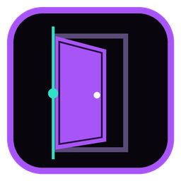
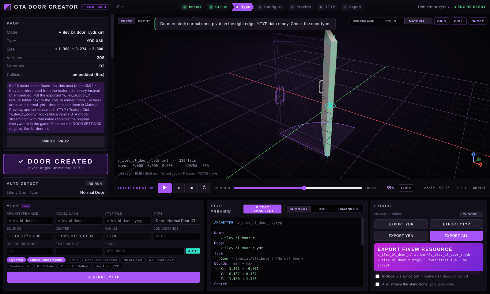
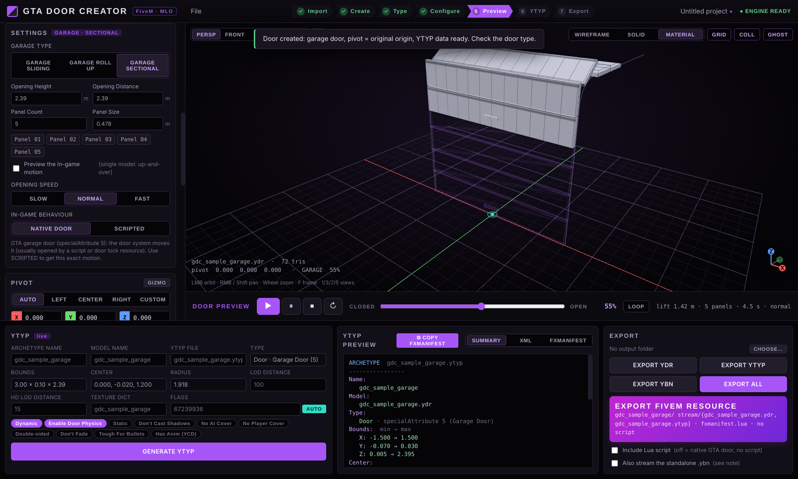
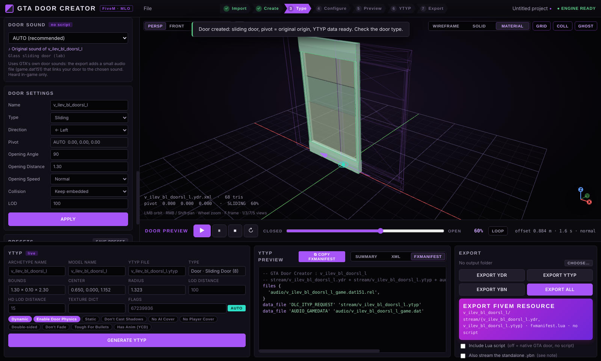

<div align="center">



# GTA Door Creator

**Turn any GTA V prop into a working FiveM door — in a few clicks, no Blender.**

`IMPORT PROP → CREATE DOOR → CHOOSE TYPE → LEFT / RIGHT → PREVIEW → GENERATE YTYP → EXPORT`

[⬇ Download (Windows)](../../releases/latest) · [Features](#features) · [How to use](#how-to-use) · [Build](#build-from-source)

</div>



## Download & install (plug and play)

1. Go to **[Releases](../../releases/latest)** and download one file:
   - **`GTA-Door-Creator-x.y.z.exe`** — **single .exe, nothing to install**: put it anywhere and double-click it.
   - or **`GTA-Door-Creator-Setup-x.y.z.exe`** — installer (start menu + desktop shortcut).
   - or the `.zip` portable folder.

Nothing else to install: the release build includes everything (no .NET, no Blender, no CodeWalker needed).

> Windows SmartScreen may say *"Windows protected your PC"* because the app is not code-signed:
> click **More info → Run anyway**.

## Features

The app is in **English or French** (⚙ Settings › Language, or the EN/FR button in the top bar; French by default on a French Windows).

The app opens on a **home page** with 6 big choices: **CREATE DOOR**, **DOOR SOUND**, **ANIMATION**, **DESTRUCT**, **TREE LOD**, **TEXTURES** (⌂ HOME in the top bar brings it back).


| | |
|---|---|
| **Import** | Drag & drop `.ydr`, CodeWalker `.ydr.xml`, `.ytyp` (reads LOD / flags / texture dictionary), `.ybn` (collision), `.ytd` (texture preview). |
| **3D viewport** | Orbit / pan / zoom, Perspective · Front · Side · Top, Grid, Wireframe · Solid · Material preview. |
| **Auto detect** | Guesses the door type and the hinge side (handle position, `_l`/`_r` suffix, models that are already pivoted like vanilla doors). |
| **Door types** | **Normal** (left/right, flip, 0–180°), **Sliding** (← → ↑ ↓, distance), **Garage** (lift, roll-up, sectional with N panels). |
| **Pivot editor** | AUTO / LEFT / CENTER / RIGHT / CUSTOM, X Y Z fields and a 3D gizmo. The pivot becomes the model origin on export; your source file is never modified. |
| **Preview** | ▶ ⏸ ⏹ ↻, CLOSED → OPEN slider, loop. |
| **Collision** | Embedded **inside the `.ydr`** (it moves with the door): auto box, convex hull, custom box, imported `.ybn`, or keep the model's own. |
| **Door sound** | Uses GTA's own door sounds — **no script**. 47 sounds from the game (wood, glass shop, fire door, jail bars, garage, roller shutter, prison gate…). Vanilla models keep their original sound automatically. |
| **Animated .ycd** | Third mode **ANIMATED .YCD**: exports the door as a GTA animated fragment — `.yft` (root + door bone) + `.ycd` (open / close clips baked from the preview) + `.yed` (expression) + fragment `.ytyp`. The **collision follows the animation**. A small Lua plays the clips with E, synced for all players. |
| **Destructible** | Door type **DESTRUCT**: the prop (a bridge, a wall, a sign…) is cut into 2–40 pieces (slider, *new cut*, break preview). Exported as a GTA breakable fragment: explosions, vehicles and bullets break the pieces off and they fall with real physics — **no script**. Strength: fragile / normal / solid / very solid, anchored or not. Or **.YCD ANIMATION**: an explosion clip baked by the app (force light → huge, intact / on the ground / rebuild times) that GTA plays and loops by itself — intact, explodes, pieces bounce and lie on the ground, then fly back together. Exports `.yft + _anim.ycd + .yed + .ytyp`, the collision of every piece follows the animation, no script. |
| **Tree LOD** | Home page **TREE LOD**: drop a ymap of GTA trees (`prop_tree_*`), the app reads your own GTA V Legacy install (read only) and makes a light LOD model per tree type (its lowest GTA detail level, GTA's own textures), a `<ymap>_lod.ymap` with one LOD per tree, a LOD `.ytyp`, and links your ymap to it (flag 8 + parentIndex, like vanilla). Trees stay visible up to 500–3000 m. Also removes the broken `LOD in Parented YMAP` flag from entities without a LOD. |
| **Textures** | Home page **TEXTURES**: type a prop / shell name, the app finds it in your own folder (server resources) then in your GTA V install (read only) and exports every texture it uses as `.dds`: embedded in the model, its `.ytd`, the parent `.ytd` (gtxd) and `mapdetail`. An MLO shell exports the textures of every object inside. Textures used but stored in another GTA `.ytd` can be found with *Search them in all GTA .ytd* (index cached after the first time). |
| **Create textures** | TEXTURES › *Create textures*: 13 seamless styles (concrete, asphalt, bricks, tiles, wood planks, brushed / rusty metal, checker, dirt, marble, fabric, stones, solid) with colours, scale, detail, contrast, joints, relief and shine. Makes the colour texture + `_n` (normal map) + `_s` (specular), compressed DXT1/DXT5 with mipmaps, as `.dds` and/or all together in one `.ytd`. |
| **Custom animation** | Door type **CUSTOM ANIM**: animate any prop with keyframes (rotation X/Y/Z in degrees, 360 = one turn, + movement in metres), presets *spin 360°*, *swing*, *bob*. Exported as an animated fragment that **starts and loops by itself in-game — no script** (logos, signs, fans…). |
| **YTYP** | Live archetype preview (summary / XML), flags, LOD, HD LOD, texture dictionary. |
| **Export** | `EXPORT YDR / YTYP / YBN / ALL` and **EXPORT FIVEM RESOURCE**. |
| **Sound only** | Already made a door? **♪ SOUND ONLY** adds a GTA door sound to existing doors (type the model names or read them from a `.ytyp`) — just one small audio file + the fxmanifest lines, nothing else changed. |
| **fxmanifest** | **⧉ COPY** button: copies the exact lines to paste in your own resource's `fxmanifest.lua`. |
| **Projects & presets** | `.doorproject` files (model embedded), built-in and custom presets. |

<p align="center">
  
  
</p>

## How to use

1. **Drop your prop** (`.ydr` or `.ydr.xml`) into the window.
2. Click **CREATE DOOR** — pivot, archetype and collision are prepared automatically.
3. Check the **door type** and **LEFT / RIGHT** (or accept the auto-detect suggestion).
4. **Preview** it with ▶.
5. Pick a **door sound** (AUTO is fine).
6. **EXPORT FIVEM RESOURCE** → copy the folder into your server's `resources/` and add `ensure <name>` to `server.cfg`.
7. Place the model in your ymap / MLO with CodeWalker.

### What you get (default: native door, no script)

```
my_door/
├── stream/
│   ├── my_door.ydr              model, origin = pivot, collision embedded
│   └── my_door.ytyp             door archetype (Dynamic + Enable Door Physics)
├── audio/
│   └── my_door_game.dat151.rel  links the door to a GTA door sound
└── fxmanifest.lua
```

The GTA door system moves the door by itself: hinged doors are pushed open by players, sliding doors and shutters use the game's door logic.

Want the exact motion of the preview (custom angle, distance, speed, E to open, synced for all players)?
Pick **SCRIPTED** (or tick *Include Lua script*): the export then adds `config.lua`, `client.lua` and `server.lua`.

### Adding a door to your own resource

Use **EXPORT ALL**, put the `.ydr`/`.ytyp` in `stream/` and the `.dat151.rel` in `audio/`, then click **⧉ COPY** in *YTYP PREVIEW → FXMANIFEST* and paste in your `fxmanifest.lua`:

```lua
files {
  'audio/my_door_game.dat151.rel',
}
data_file 'DLC_ITYP_REQUEST' 'stream/my_door.ytyp'
data_file 'AUDIO_GAMEDATA' 'audio/my_door_game.dat'
```

### Tips

- A model with a vanilla name (`v_ilev_*`, `prop_*`…) replaces the original everywhere in the game — rename it in **DOOR SETTINGS**.
- CodeWalker XML: keep the exported texture folder next to the `.ydr.xml` to embed the textures.
- Shortcuts: `Space` play · `F` frame · `1` `3` `7` `5` views · `G` grid · `C` collision · `Z` shading · `Ctrl+S/O/N/I`.

## Build from source

Requirements: **Node.js 20+** and the **.NET 8 SDK** (Windows).

```bat
npm ci
npm run publish:core:win   :: self-contained DoorCore engine
npm run dist:win           :: dist\GTA-Door-Creator-Setup-x.y.z.exe + portable zip
```

or just run `build-windows.bat`. Dev mode: `npm run build:core` then `npm start`.

### Publishing a release

The GitHub Action in `.github/workflows/release.yml` builds everything on Windows and attaches the installer + zip to a Release when you push a tag:

```bash
git tag v1.11.0
git push origin v1.11.0
```

### Project layout

```
app/                  Electron app (main process + renderer, three.js viewer)
  renderer/js/        app.js (UI), door.js (door logic), viewer.js (3D), fivem.js (resource),
                      doorsounds.js (GTA door sound catalog), presets.js
core/                 DoorCore: .NET 8 engine built on CodeWalker.Core (YDR / YTYP / YBN / audio)
  src/                Loader, Exporter, Audio, TestBuilder
  vendor/             CodeWalker.Core + SharpDX.Mathematics sources (MIT)
build/                icons
.github/workflows/    Windows build & release
```

`DoorCore.exe load <file>` and `DoorCore.exe export <job.json>` also work from the command line.

## Credits & license

MIT © Fred — see [LICENSE](LICENSE) and [THIRD_PARTY_NOTICES.md](THIRD_PARTY_NOTICES.md).
Built on [CodeWalker](https://github.com/dexyfex/CodeWalker) by dexyfex and [three.js](https://threejs.org).
Not affiliated with Rockstar Games or Cfx.re.

## Blender add-on (doors)

**📖 Tutorial (FR / EN): [blender/README.md](blender/README.md)** · download **`GTA-Door-Creator-Blender.zip`** from [Releases](../../releases).

`blender/gta_door_creator.py` - the door tool inside Blender, built on **Sollumz** (needed, with PyMateria for direct binary export).

Install: Blender › Edit › Preferences › Add-ons › ⌄ › *Install from Disk…* › `gta_door_creator.py`, enable it. Sidebar (N) › **Door Creator**:

1. Select your door (mesh(es) or a Sollumz Drawable) › **Détection auto** (type + hinge side, handle detection)
2. Name, type (normal / sliding / garage), hinge or direction, collision (box + material), GTA door sound, LOD
3. **Créer la porte**: origin on the pivot, Sollumz Drawable, box collision, YTYP archetype (flags 67239936 + specialAttribute 7/8/10/5)
4. Preview slider (opening in Blender only)
5. **Exporter la ressource FiveM**: `stream/` (.ydr + .ytyp via Sollumz), `audio/<name>_game.dat151.rel` (door sound), `fxmanifest.lua`, README
